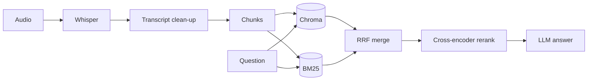

# Debrief

Debrief takes a meeting recording and gives you a transcript you can ask questions about, plus minutes of meeting (MoM) and a slide deck.

Under the hood it's Whisper for transcription and a RAG pipeline for Q&A. Retrieval uses BM25 and vector search together, then a cross-encoder reranks the results. I evaluated retrieval on meetings from the QMSum benchmark. Reranking took MRR from 0.68 to 0.78 and evidence recall from 0.33 to 0.46 (details below).

## Features

- Transcribe `.mp3`, `.wav` or `.m4a` audio with faster-whisper, then clean up the transcript with an LLM
- Ask questions about the meeting and get answers grounded in the transcript
- Generate minutes of meeting: summary, decisions, action items, next steps
- Export a PowerPoint deck
- Optional spoken answers with Edge-TTS

## How it works



The transcript is split into 800-character chunks and indexed twice: embeddings in Chroma, and a BM25 keyword index. For a question, both return their top 10 chunks. Those get merged with reciprocal rank fusion, a cross-encoder re-scores the merged list, and the top 3 go to the LLM.

I added BM25 because meetings are full of names, numbers and product terms that embeddings don't match well. The reranker is there because it reads the question and chunk together, so it ranks better than vector similarity on its own.

The frontend is Streamlit and the backend is FastAPI. The LLM can be Groq or a local Ollama model, set in `.env`.

## Evaluation

I used 29 questions from 10 meetings in [QMSum](https://github.com/Yale-LILY/QMSum). QMSum has real product-design meetings with human-written questions and answers, and it marks which parts of the transcript each answer comes from. That makes it possible to check whether retrieval found the right part of the meeting, without needing an LLM to grade it.

| Retrieval | hit@3 | MRR | Evidence recall | Latency (p50) |
|---|---|---|---|---|
| Vector only (original) | 0.79 | 0.68 | 0.33 | 23 ms |
| BM25 + vector | 0.79 | 0.69 | 0.40 | 19 ms |
| BM25 + vector + rerank | 0.83 | 0.78 | 0.46 | 317 ms |

- hit@3: whether any of the top 3 chunks contains the answer's evidence
- MRR: how high the first relevant chunk ranks
- Evidence recall: how much of the evidence the top 3 chunks cover

Adding BM25 mostly helped coverage. The reranker helped both ranking and coverage, at the cost of about 300 ms per question on a laptop CPU.

The eval also runs DeepEval (faithfulness, answer relevancy, contextual relevancy) with a configurable judge model. The full per-question output is in `evals/results/`.

To run it:

```bash
uv run python -m evals.run --no-judge                  # retrieval metrics only
uv run python -m evals.run --judge ollama:llama3.1:8b  # with DeepEval
```

Results are saved after every question, so the run can be stopped and resumed.

Things I want to try next: retrieving more chunks for summary-style questions, and smaller chunks that pull in their neighbours.

## Running it

You need Python 3.14 and [uv](https://docs.astral.sh/uv/).

```bash
git clone https://github.com/Gunjit27/Minutes-of-Meeting.git
cd Minutes-of-Meeting
uv sync
cp .env.example .env    # add your GROQ_API_KEY
```

Then start the backend and frontend in separate terminals:

```bash
uv run uvicorn main:app --reload
uv run streamlit run app.py
```

To run everything locally instead, set `LLM_PROVIDER=ollama` and `EMBED_PROVIDER=ollama` in `.env`, and pull `llama3.1:8b` and `nomic-embed-text` in Ollama. The other options, like model names and retrieval mode, are listed in `.env.example`.

## Project layout

```text
app.py              Streamlit frontend
main.py             FastAPI app
logic/
  llm.py            picks Groq or Ollama
  transcription/    Whisper and transcript clean-up
  rag/              chunking, retrieval, reranking, answers
  mom/              minutes of meeting
  create_ppt/       slides
evals/              QMSum dataset, eval runner, results
```

## Limitations

The app keeps state in memory, so it handles one meeting at a time. There's no hosted demo yet.

Eval data is from QMSum (MIT license), which is built on the AMI Meeting Corpus.
