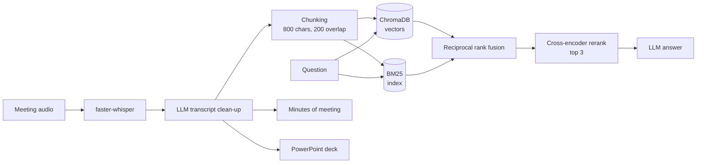

# Debrief

**Turn a meeting recording into a transcript, a Q&A chatbot, minutes and slides, with retrieval quality measured on a public benchmark.**

Upload an audio file, and Debrief transcribes it with Whisper, indexes it for hybrid search, answers questions grounded in what was said, and exports structured minutes of meeting (MoM) and a PowerPoint deck.

- **Hybrid retrieval with reranking:** BM25 keyword search and vector search, fused with reciprocal rank fusion, then re-scored by a cross-encoder.
- **Measured, not claimed:** on 29 human-annotated questions from the [QMSum](https://github.com/Yale-LILY/QMSum) meeting benchmark, reranking raised **MRR from 0.68 to 0.78** and **evidence recall from 0.33 to 0.46**.
- **Runs hosted or fully local:** Groq or Ollama for the LLM, sentence-transformers or Ollama for embeddings, switched in `.env`.

## Features

| Feature | How |
|---|---|
| Transcription | faster-whisper (`small`, int8 on CPU) with voice-activity filtering, then an LLM clean-up pass |
| Q&A over the meeting | Hybrid BM25 + vector retrieval, cross-encoder rerank, answer grounded only in the top 3 chunks |
| Minutes of meeting | Summary, discussion points, decisions, action items and next steps |
| Slides | A `.pptx` deck generated from the transcript |
| Voice answers | Optional text-to-speech of answers with Edge-TTS |

## Architecture



The Streamlit frontend (`app.py`) talks to a FastAPI backend (`main.py`). Each uploaded meeting gets its own in-memory index, so answers never mix in earlier meetings.

## Evaluation

### Method

The eval runs on **29 questions over 10 real meetings** from QMSum, which are AMI product-design meetings of 10k to 40k characters each. QMSum's questions and answers are written by people, and every answer is tied to the transcript turns that support it. Those turns become gold evidence spans, so retrieval can be scored without an LLM.

Each question is answered with the app's own prompt and model, once per retrieval mode, and scored two ways:

- **Retrieval, no LLM involved:** hit@3 (whether a top-3 chunk overlaps the evidence), MRR, and evidence recall (the share of the evidence text the top 3 chunks cover).
- **Answer quality, with DeepEval:** faithfulness, answer relevancy and contextual relevancy, graded by a pluggable LLM judge.

### Results

| Retrieval mode | hit@3 | MRR | Evidence recall | p50 retrieval |
|---|---|---|---|---|
| Vector only (MMR, original) | 0.79 | 0.68 | 0.33 | 23 ms |
| Hybrid (BM25 + vector, RRF) | 0.79 | 0.69 | 0.40 | 19 ms |
| **Hybrid + cross-encoder rerank** | **0.83** | **0.78** | **0.46** | 317 ms |

Retrieval latency was measured on a laptop CPU. Per-question output, including retrieved chunks and generated answers, is in [`evals/results/`](evals/results/).

### What the numbers say

- **Reranking fixes ranking.** The right evidence lands first more often (MRR up 15%), and the top 3 chunks cover 39% more of it, for about 300 ms more per query.
- **BM25 matters for meetings.** Hybrid search alone lifts evidence recall from 0.33 to 0.40, likely because meetings are full of exact names, numbers and product terms that embeddings blur together.

**Next experiments:** retrieve 5 to 6 chunks for summary-style questions, and use smaller chunks with neighbour expansion. Each one is a single-command comparison against these baselines.

### Reproduce

```bash
uv run python -m evals.run --no-judge                  # retrieval metrics only, no API calls
uv run python -m evals.run --judge ollama:llama3.1:8b  # plus DeepEval scores
```

The judge is pluggable (`groq:<model>`, `gemini:<model>` or `ollama:<model>`). Progress is saved after every question, so a run cut off by a rate limit resumes where it stopped, and switching judges re-scores every row so the modes stay comparable. `evals/build_qmsum.py` rebuilds the dataset in `evals/data/` from a QMSum checkout.

## Design decisions

- **Why hybrid search:** meetings are full of exact names, numbers and product terms that embeddings blur together. BM25 catches them, and reciprocal rank fusion merges both rankings without tuning score weights.
- **Why a cross-encoder:** it reads the question and the chunk together, which ranks more accurately than comparing two separately computed vectors. It only re-scores 20 candidates, so the cost stays small.
- **Why QMSum instead of my own recordings:** it has real hour-long meetings with human-written answers and marked evidence, so retrieval can be scored objectively and anyone can re-run the eval.
- **Why a provider switch:** the same code runs on free hosted models or fully offline, and the eval can hold the answer model fixed while swapping the judge.

## Quickstart

Requires Python 3.14 and [uv](https://docs.astral.sh/uv/).

```bash
git clone https://github.com/Gunjit27/Minutes-of-Meeting.git
cd Minutes-of-Meeting
uv sync
cp .env.example .env        # then set GROQ_API_KEY (free key: https://console.groq.com/keys)
```

Start the backend and the frontend in two terminals:

```bash
uv run uvicorn main:app --reload
uv run streamlit run app.py
```

To run fully offline, set `LLM_PROVIDER=ollama` and `EMBED_PROVIDER=ollama` in `.env`, then pull `llama3.1:8b` and `nomic-embed-text` in Ollama.

### Configuration

| Variable | Default | Options |
|---|---|---|
| `LLM_PROVIDER` | `ollama` | `groq`, `ollama` |
| `GROQ_MODEL` | `openai/gpt-oss-20b` | any Groq chat model |
| `OLLAMA_MODEL` | `llama3.1:8b` | any Ollama chat model |
| `EMBED_PROVIDER` | `ollama` | `hf` (sentence-transformers), `ollama` |
| `HF_EMBED_MODEL` | `BAAI/bge-small-en-v1.5` | any sentence-transformers model |
| `RETRIEVAL_MODE` | `hybrid_rerank` | `vector`, `hybrid`, `hybrid_rerank` |
| `RERANK_MODEL` | `cross-encoder/ms-marco-MiniLM-L-6-v2` | any cross-encoder |
| `JUDGE_MODEL` | `groq:openai/gpt-oss-120b` | `groq:…`, `gemini:…`, `ollama:…` |

### API

| Method | Endpoint | Does |
|---|---|---|
| `POST` | `/upload_audio` | Transcribe, clean and index an `.mp3`, `.wav` or `.m4a` file |
| `POST` | `/ask` | Answer a question about the current meeting |
| `POST` | `/ask-tts` | Answer and return a spoken MP3 |
| `GET` | `/audio/{filename}` | Fetch a generated MP3 |
| `POST` | `/generate-mom` | Generate minutes of meeting |
| `POST` | `/generate-ppt` | Generate and download a `.pptx` deck |

Interactive docs are at `http://127.0.0.1:8000/docs` while the backend runs.

## Project structure

```text
.
├── app.py                  Streamlit frontend
├── main.py                 FastAPI app and routers
├── state.py                In-memory state for the current meeting
├── Dockerfile              Single-container build (FastAPI + Streamlit)
├── logic/
│   ├── llm.py              LLM and embedding provider switch
│   ├── api/                HTTP endpoints
│   ├── transcription/      Whisper transcription and clean-up
│   ├── rag/                Chunking, hybrid retrieval, reranking, answers
│   ├── mom/                Minutes of meeting
│   └── create_ppt/         Slide generation
└── evals/
    ├── build_qmsum.py      Builds the dataset from QMSum
    ├── run.py              Retrieval metrics and DeepEval runner
    ├── judge.py            Pluggable judge models
    ├── data/               10 meeting transcripts and golden.json
    └── results/            Per-question results and summary
```

## Limitations

- State lives in memory, so the app holds one meeting at a time for a single user.
- There's no hosted demo yet.

## Acknowledgements

The evaluation data comes from [QMSum](https://github.com/Yale-LILY/QMSum) (MIT license), which is built on the [AMI Meeting Corpus](https://groups.inf.ed.ac.uk/ami/corpus/).
